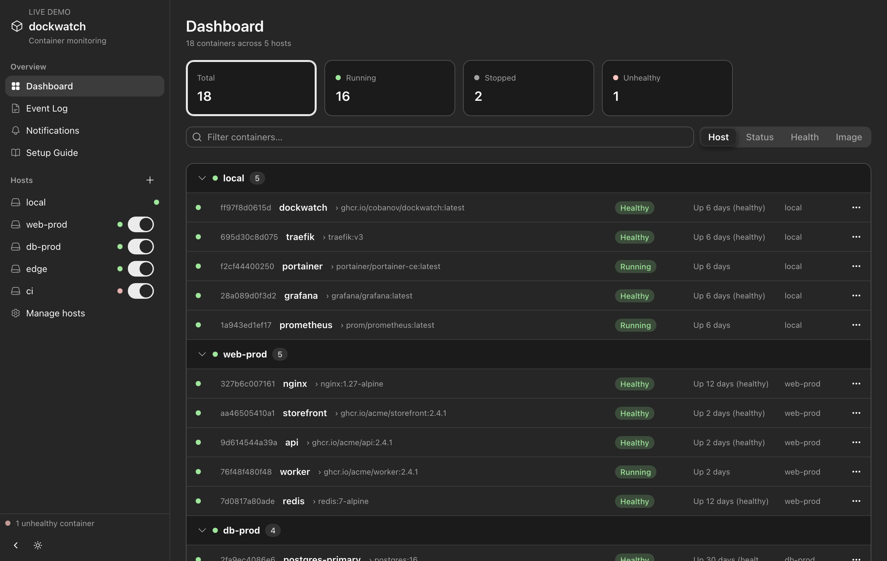

# dockwatch

A tiny self-hosted watchdog for your Docker containers — it watches every container on the machine (and remote ones over SSH) and pings your phone the moment something breaks.

**[▶ Live demo](https://dockwatch-demo.pages.dev)** — the real dashboard with sample data, no install.



## Quick start

```bash
git clone https://github.com/cobanov/dockwatch.git
cd dockwatch
docker compose up -d --build
```

Open **http://localhost:9622**, pick an ntfy topic, and subscribe to that topic in the [ntfy app](https://ntfy.sh/) on your phone. That's it.

## What you get

- **Phone alerts** when a container goes unhealthy, crashes, recovers, stops or starts — fired only on real state changes and rate-limited, so you're never spammed.
- **One dashboard for every host** — group by host, status, health or image, with live colour-coded states, an event log, and light/dark themes.
- **Remote hosts over SSH** — add a machine from the UI; nothing to install on the other side.
- **Zero config files** — everything is set in the UI and saved to a Docker volume.

Single static Go binary (~11 MB image), React + [Astryx](https://astryx.atmeta.com) UI embedded in. Runs anywhere Docker does: macOS, Windows (WSL2), Linux.

<details>
<summary><b>Remote hosts, environment variables & development</b></summary>

### Remote hosts

Add a machine with the **+** next to *Hosts* in the sidebar (or the **Manage hosts** page): its address, SSH user, and optionally a port, alias, key path or password.

- **Auth:** SSH keys / ssh-agent (recommended) or a password (stored in plain text in the config). Keys are read from `~/.ssh`, mounted read-only into the container. The remote user must be able to reach `/var/run/docker.sock` (i.e. in the `docker` group).
- **Manage:** the toggle next to a host pauses/resumes monitoring. The Hosts page imports/exports hosts as JSON (passwords are never exported), and dockwatch also picks up hosts from your mounted `~/.ssh/config`.

### Environment variables

| Variable | Default |
|---|---|
| `PORT` | `9622` |
| `DOCKER_SOCKET` | `/var/run/docker.sock` |
| `CONFIG_PATH` | `/data/config.json` |
| `EVENTS_PATH` | `/data/events.json` |
| `SSH_KEY_DIR` | `/ssh` |
| `SSH_CONFIG_PATH` | `/ssh/config` |
| `KNOWN_HOSTS_PATH` | `/data/known_hosts` |

### Development

```bash
# build the UI once (go:embed needs web/dist to exist)
cd web && npm install && npm run build && cd ..

# backend
CONFIG_PATH=./config.json go run .

# UI with hot reload (proxies /api to :9622)
cd web && npm run dev
```

### Static demo build

`cd web && npm run build:demo` emits a backend-free build to `web/dist` (in-memory sample data) that deploys to any static host — Cloudflare Pages, Netlify, GitHub Pages, …

</details>

## License

MIT
