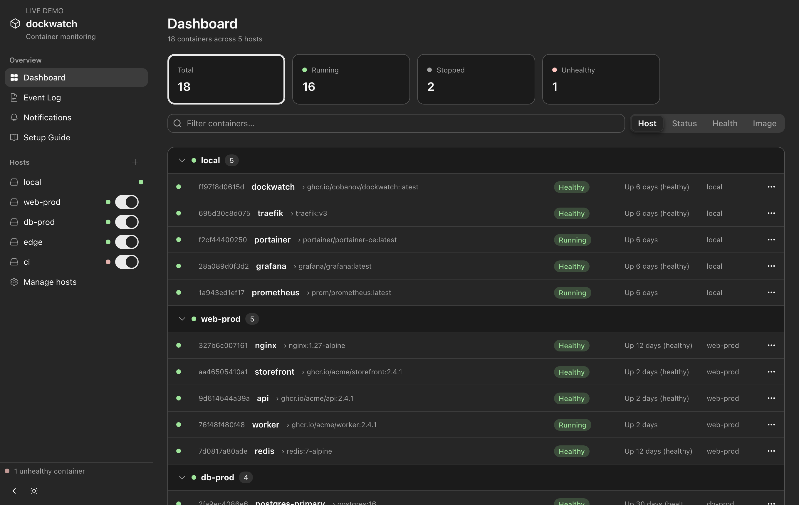

# watchdock

A tiny self-hosted watchdog for your Docker containers. It watches every container on the machine, and on other machines over SSH, and pushes an alert to your phone through [ntfy](https://ntfy.sh) the moment something breaks.

**[▶ Live demo](https://watchdock-demo.pages.dev)** · **[Website](https://watchdock.cobanov.dev)**



## Quick start

**1. Run it.** Grab the compose file and start the published image:

```bash
mkdir watchdock && cd watchdock
curl -fsSLo docker-compose.yml https://raw.githubusercontent.com/cobanov/watchdock/main/docker-compose.example.yml
docker compose up -d
```

**2. Open the dashboard** at **http://localhost:9622**. Under *Notifications* you will find a private topic that watchdock generated on first start (`watchdock-` plus 12 random characters). Press **Send test notification**.

**3. Get the alert on your phone.** Install the ntfy app ([iOS](https://apps.apple.com/app/ntfy/id1625396347), [Android](https://play.google.com/store/apps/details?id=io.heckel.ntfy)), subscribe to the same topic, and the test arrives. From now on so does every crash.

Prefer a single command? This watches the local machine only:

```bash
docker run -d --name watchdock --restart unless-stopped -p 9622:9622 \
  -v /var/run/docker.sock:/var/run/docker.sock:ro \
  -v watchdock-data:/data \
  ghcr.io/cobanov/watchdock:1
```

Images are multi-arch (amd64, arm64) on GHCR (`ghcr.io/cobanov/watchdock`) and [Docker Hub](https://hub.docker.com/r/cobanov/watchdock) (`cobanov/watchdock`). Tags: `1` (latest 1.x), `1.0`, `1.0.0`, `latest`.

> **Security:** the dashboard has no login, and it shows your containers and your config (including the ntfy token and any SSH passwords). Keep port 9622 on a trusted network, bind it to localhost (`"127.0.0.1:9622:9622"`), or put it behind a reverse proxy with authentication such as Cloudflare Access.

## What it alerts on

| Alert | When |
|---|---|
| **Down** | A container exits with a non-zero code. A `docker stop` or `docker kill` is not a crash. |
| **Unhealthy** | A container's healthcheck starts failing. |
| **Recovered** | A crashed container has stayed up for 30 seconds, or a failing healthcheck passes again. |
| **Stopped** | A container exits cleanly or is stopped by hand. |
| **Started** | A container starts. |

Each kind can be switched off in the UI. Stopped and Started are the noisy ones on busy machines.

- Each kind of alert is sent at most once per container every 5 minutes, so a crash loop is one message, not hundreds.
- Missed events are caught up by a reconcile every 30 seconds, so nothing is lost while the event stream reconnects.
- **Ignore list:** container names or glob patterns (`*-migrate-*`) that should never alert. watchdock never alerts about itself.
- Every transition also lands in the **Events** page, whether or not it was sent to your phone.

## Remote hosts over SSH

watchdock can watch Docker on other machines without installing anything on them. Add a host with the **+** next to *Hosts* in the sidebar, or on the **Manage hosts** page: an alias, the address, the SSH user, and optionally a port and key path. **Test connection** checks it before you save.

- **Requirements on the remote side:** an SSH server and a user that can use Docker (in the `docker` group).
- **Keys:** your `~/.ssh` is mounted read-only at `/ssh`. watchdock tries `id_ed25519`, `id_rsa` and `id_ecdsa`, or the key path you set for the host (as seen inside the container, e.g. `/ssh/id_homelab`). Passphrase-protected keys need ssh-agent: on macOS uncomment the agent lines in the compose file.
- **Passwords** work too, but are stored in plain text in the config. Prefer keys.
- **Host keys:** trust on first use. The first key a host presents is saved to `/data/known_hosts`; a different key later is refused. If you reinstalled the host, remove its line from that file.
- **`~/.ssh/config`:** on start, and with **Import SSH config** in the host dialog, watchdock adds every `Host` block that has a literal alias and a `User`.
- **Hardened servers (Synology DSM):** when the server refuses Unix socket forwarding, watchdock carries the Docker API over `docker system dial-stdio` on a normal SSH session instead, so DSM's SSH policy can stay as it is.
- **Per-host topic:** a host can send its alerts to its own ntfy topic (*Notification topic* in the host dialog). Hosts without one, and the machine watchdock runs on, use the global topic. Handy for routing work machines to a team topic.
- **Pause** a host with its toggle. The Hosts page also imports and exports hosts as JSON; passwords are never exported.
- A host that cannot be reached at all does not send an alert. `GET /api/containers` reports `"ok": false` for it, which an external uptime check can watch.

## ntfy

| Setting | What it does |
|---|---|
| **Server** | `https://ntfy.sh` by default, or your own ntfy server. |
| **Topic** | Where alerts go. Anyone who knows a topic on a public server can read it, so keep the generated one or pick something unguessable. Clear it to switch notifications off. |
| **Token** | Access token for servers that require auth (sent as `Authorization: Bearer`). |
| **Per-host topic** | Set in each host's dialog, see above. |

**Send test notification** uses what is on screen, before you save. On a self-hosted server, iPhones only get instant pushes if the server sets `upstream-base-url: "https://ntfy.sh"`.

## Configuration

Everything is set in the UI and saved to `/data/config.json` in the `watchdock-data` volume. Nothing is required up front: a fresh install starts with the defaults and a generated topic. To start from a file, put your own `config.json` in the volume before the first start; [`config.example.json`](config.example.json) shows every field.

| Field | Default | Notes |
|---|---|---|
| `ntfyServer` | `https://ntfy.sh` | |
| `ntfyTopic` | generated | Empty means notifications are off. |
| `ntfyToken` | empty | |
| `notifyUnhealthy`, `notifyDown`, `notifyRecovered`, `notifyStopped`, `notifyStarted` | `true` | One switch per alert kind. |
| `ignore` | `[]` | Names or glob patterns. |
| `hosts[]` | `[]` | Each needs `alias` (lowercase, unique, not `local`), `host` and `user`. Optional: `port` (22), `keyPath`, `password`, `disabled`, `ntfyTopic`. |

### Environment variables

| Variable | Default |
|---|---|
| `PORT` | `9622` |
| `DOCKER_SOCKET` | `/var/run/docker.sock` |
| `CONFIG_PATH` | `/data/config.json` |
| `EVENTS_PATH` | `/data/events.json` |
| `KNOWN_HOSTS_PATH` | `/data/known_hosts` |
| `SSH_KEY_DIR` | `/ssh` |
| `SSH_CONFIG_PATH` | `/ssh/config` |
| `SSH_AUTH_SOCK` | unset; point it at a mounted ssh-agent socket |

## Build from source

```bash
git clone https://github.com/cobanov/watchdock.git
cd watchdock
docker compose up -d --build
```

### Development

```bash
# build the UI once (go:embed needs web/dist to exist)
cd web && npm install && npm run build && cd ..

# backend
CONFIG_PATH=./config.json go run .

# UI with hot reload (proxies /api to :9622)
cd web && npm run dev

# tests
go test ./...
```

`cd web && npm run build:demo` emits a backend-free build to `web/dist` with in-memory sample data, which deploys to any static host. That is what the live demo runs.

## License

MIT
